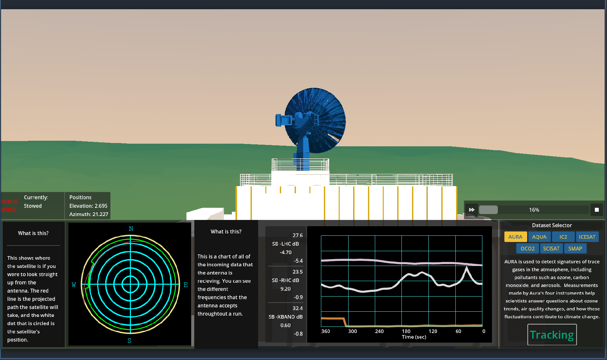

# ASF Antenna Exhibit Frontend
Touchscreen interface for the Alaska Satellite Facility's University of Alaska Museum of the North exhibit, running from May 2025 - January 2026.

## Summary
The frontend is written in Godot, and allows users to rotate a camera around an animated model of a antenna and select satellites to track with the antenna. The 3D model is synced with a large scale model of the same antenna, that is controlled by the same interface.

## Frontend
 The frontend primary controls are selecting a satellite to track and see some info about, as well as a button to start to "track" the satellite. The track button starts moving the 3D model, as well as sending a request to the [backend API](https://github.com/asfadmin/antenna-museum-exhibit-api) to start moving the real life model via the [controller board's API](https://github.com/asfadmin/antenna-museum-exhibit-backend).

### Satellite Tracker
The leftmost figure shows the relative position of the satellite to the antenna, as well as an estimated path the satellite will tack throughout its pass.
### Signal Tracker
The middle chart shows the strength of the signal collected by the antenna throughout the pass.
